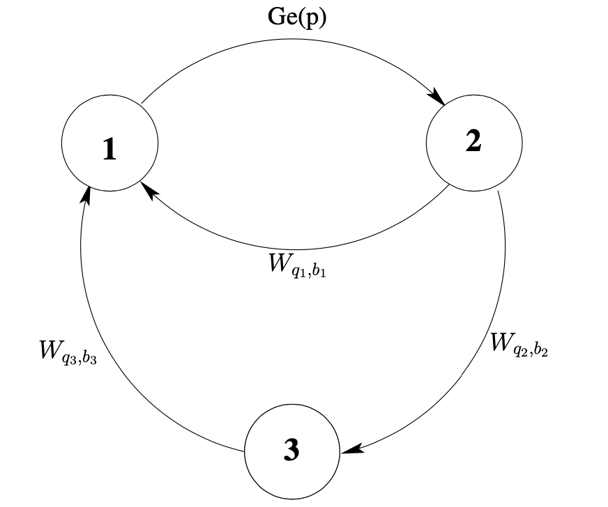

```{r setup, include=FALSE}
library(knitr)
knitr::opts_chunk$set(
	fig.align = "center",
	fig.height = 5.5,
	fig.width = 6,
	warning = FALSE,
	collapse = TRUE,
	dev.args = list(pointsize = 10),
	out.width = "65%"
)
```

```{r, message = FALSE, echo = FALSE}
library(smmR)
library(DiscreteWeibull)
```

# Context

In order to illustrate the package SMM we introduce a practical example
taken from **@BarbuLimnios2008**, where a semi-Markov modeling is
appropriate. Let $\mathcal{F}$ be a textile factory. To avoid river
pollution, the factory waste is treated in the unit $\mathcal{U}$ before
being thrown in the river $\mathcal{R}$. In order for the factory not to
be stopped if a failure occurs in the treatment unit $\mathcal{U}$, the
waste is stocked in a tank $\mathcal{T}$. If $\mathcal{U}$ is repaired
before $\mathcal{T}$ is full, then the factory starts to work again
normally and we suppose that the tank is emptied instantaneously (before
another failure of $\mathcal{U}$). Otherwise, the whole factory has to
stop and a certain time is necessary to restart it. The figure below
describes the waste treatment system of the textile factory.

<br />

```{r echo = FALSE, out.width = '400px', fig.cap = 'Waste treatment for a textile factory'}
knitr::include_graphics("Waste_treatment.png")
```

<br />

As the output of the factory is variable, the filling time of the tank
is a random variable. Moreover, if we suppose that the filling time is
deterministic, we can still make the assumption that we have a random
time that has a Dirac distribution.

We propose a semi-Markov modelization for the evolution of the described
system. Let
$E = \{\texttt{"}1\texttt{"},\ \texttt{"}2\texttt{"},\ \texttt{"}3\texttt{"}\}$
be the set of possible states of the system, where we set:

-   **State 1** - everything is working, that is, $\mathcal{F}$ and
    $\mathcal{U}$ are in good state and $\mathcal{T}$ is empty;
-   **State 2** - $\mathcal{U}$ has failed, but $\mathcal{T}$ is not yet
    full, so the factory is still working;
-   **State 3** - $\mathcal{U}$ has failed and $\mathcal{T}$ is full, so
    the factory is not working.

The possible transitions between states are given in the following
figure:

<br />

```{r echo = FALSE, out.width = '400px', fig.cap = 'Three-state discrete-time semi-Markov system modelization'}

```

<br /> <br />

The system is defined by:

-   The initial distribution
    $\boldsymbol{\alpha} = (\alpha_1,\ \alpha_2,\ \alpha_3)$;

-   The transition matrix $\boldsymbol{p}$ of the embedded Markov chain
    $(J_n)_{n \in \mathbb{N}}$
    $\boldsymbol{p} = \begin{pmatrix} 0 & 1 & 0 \\ a & 0 & b \\ 1 & 0 & 0 \end{pmatrix}$,

-   The conditional sojourn time distributions
    $\boldsymbol{f(k)} = \begin{pmatrix} 0 & f_{12}(k) & 0 \\ f_{21}(k) & 0 & f_{23}(k) \\ f_{31}(k) & 0 & 0 \end{pmatrix}, \ k \in \mathbb{N}$,

    where,

    -   $f_{12}$ is the distribution of the failure time of the
        treatment unit $\mathcal{U}$;

    -   $f_{21}$ is the distribution of the repairing time of
        $\mathcal{U}$;

    -   $f_{23}$ is the distribution of the filling time of the tank
        $\mathcal{T}$;

    -   $f_{31}$ is the distribution of time needed to restart the
        entire factory $\mathcal{F}$, after it has been shut down.

This is an irreducible discrete-time semi-Markov system, or,
equivalently, a Markov renewal system. We chose the following sojourn
time distributions:

-   $f_{12}$ is the geometric distribution on $\mathbb{N}^{*}$ of
    parameter $p$, $0 < p < 1$, i.e.,
    $f_{12}(k) = p(1 - p)^{k - 1},\ k \in \mathbb{N}^{*}$.

-   $f_{21} = W_{q1, b1},\ f_{23} = W_{q2, b2},\ f_{31} = W_{q3, b3}$
    are discrete-time first-type Weibull distributions (**@Nakagawa1975**),
    defined by:
    $$W_{q, b}(0) = 0,\ W_{q, b}(k) = q^{(k - 1)^{b}} - q^{k^{b}},\ k \in \mathbb{N}^{*}$$

The choice of discrete-time Weibull distribution is motivated by its use
in reliability theory, due to its flexibility in modeling failure rates.
In fact, our main purpose in this document is to compute and estimate
the main reliability indicators of this system.

<br />

# Numerical application

Let us continue the example of the textile factory presented above. We
take the initial distribution $\boldsymbol{\alpha} = (1,\ 0,\ 0)$, the
transition matrix of the embedded Markov chain
$(J_{n})_{n \in \mathbb{N}}$,
$$ \boldsymbol{p} = \begin{pmatrix} 0 & 1 & 0 \\ 0.95 & 0 & 0.05 \\ 1 & 0 & 0 \end{pmatrix} $$
and the following conditional sojourn time distributions:

-   $f_{12}$ is the geometric distribution on $\mathbb{N}^{*}$ with
    parameter $p = 0.8$;

-   $f_{21} = W_{q1, b1},\ f_{23} = W_{q2, b2},\ f_{31} = W_{q3, b3}$
    are discrete-time Weibull distributions with parameters:
    $$ q_{1} = 0.3,\ b_{1} = 0.5,\ q_{2} = 0.5,\ b_{2} = 0.7,\ q_{3} = 0.6,\ b_{3} = 0.9.$$

## Specification and simulation

First, let us create a **smmparametric** object to represent the semi-Markov 
chain associated to the system:

```{r}
states <- c("1", "2", "3") # State space

alpha <- c(1, 0, 0) # Initial distribution

p <- matrix(data = c(0, 1, 0, 
                     0.95, 0, 0.05, 
                     1, 0, 0), nrow = 3, byrow = TRUE) # Transition matrix

distr <- matrix(c(NA, "geom", NA, 
                  "dweibull", NA, "dweibull", 
                  "dweibull", NA, NA), 
                nrow = 3, ncol = 3, byrow = TRUE) # Distribution matrix

param1 <- matrix(c(NA, 0.8, NA, 
                   0.3, NA, 0.5,
                   0.6, NA, NA), 
                 nrow = 3, ncol = 3, byrow = TRUE)

param2 <- matrix(c(NA, NA, NA, 
                   0.5, NA, 0.7,
                   0.9, NA, NA), 
                 nrow = 3, ncol = 3, byrow = TRUE)

parameters <- array(c(param1, param2), c(3, 3, 2))

factory <- smmparametric(states = states, init = alpha, ptrans = p, 
                         type.sojourn = "fij", distr = distr, param = parameters)
```

After that, we are able to simulate a sequence of sample sizes
$M = 10,000$:

```{r}
M <- 10000
seq <- simulate(object = factory, nsim = M)
```

## Estimation

Thanks to the **SMM** package, we can estimate any semi-Markov model
with one or several discrete sequences. In our case, we are going to
introduce a **non-parametric estimation**:

```{r}
estimate <- fitsmm(sequences = seq, states = states, type.sojourn = "fij")
```

The estimate $\hat{p}$ of the transition matrix $p$ is:

```{r}
print(x = estimate$ptrans, digits = 2)
```

We can also plot the estimated sojourn time densities. For example, let
us plot the sojourn time distribution $\hat{f}_{23}$:

```{r}
plot(x = estimate, i = "2", j = "3", type = "l", col = "blue")

lines(x = 1:estimate$kmax, y = ddweibull(x = 1:estimate$kmax, q = 0.5, beta = 0.7), 
       col = "red", pch = "x")

legend(x = "topright", 
       legend = c("True value", "Estimate"), 
       col = c("red", "blue"), lty = c(1, 1))
```

<br />

In the following sections, based on the model specification `factory` and the 
estimate of the latter `estimate`, we can compute true and estimated values of 
some indicators such as reliability, availability, maintainability as well as 
their asymptotic confidence intervals.

## Reliability

Consider a system $S_{ystem}$ starting to function at time $k = 0$. The
**reliability** of $S_{ystem}$ at time $k \in \mathbb{N}$ is the
probability that the system has functioned without failure in the period
$[0, k]$. Let's take $k = 300$.

```{r}
k <- 300
upstates <- c("1", "2") # Working states of the semi-Markov system
```

```{r}
trueReliab <- reliability(x = factory, k = k, upstates = upstates)
estReliab <- reliability(x = estimate, k = k, upstates = upstates)
```

```{r}
plot(x = 0:k, y = trueReliab[, 1], type = "l", cex = 2.5, ylim = c(0, 1), 
     col = "red", main = "Reliability", xlab = "k", ylab = "R(k)")

lines(x = estReliab[, 1], col = "blue")
lines(x = estReliab[, 3], lty = 4, col = "blue")
lines(x = estReliab[, 4], lty = 4, col = "blue")
legend(x = "topright", 
       legend = c("True value", "Estimated value", "95% confidence interval"), 
       col = c("red", "blue", "blue"), lty = c(1, 1, 4))
```

## Availability

The pointwise (or instantaneous) **availability** of a system
$S_{ystem}$ at time $k \in \mathbb{N}$ is the probability that the
system is operational at time $k$ (independently of the fact that the
system has failed or not in $[0, k)$).

```{r}
trueAvail <- availability(x = factory, k = k, upstates = upstates)
estAvail <- availability(x = estimate, k = k, upstates = upstates)
```

```{r}
plot(x = 0:k, y = trueAvail[, 1], type = "l", cex = 2.5, ylim = c(0.95, 1), 
     col = "red", main = "Availability", xlab = "k", ylab = "A(k)")

lines(x = estAvail[, 1], col = "blue")
lines(x = estAvail[, 3], lty = 4, col = "blue")
lines(x = estAvail[, 4], lty = 4, col = "blue")
legend(x = "topright", 
       legend = c("True value", "Estimated value", "95% confidence interval"), 
       col = c("red", "blue", "blue"), lty = c(1, 1, 4))
```

## Failure Rates

Following the lines of **@BarbuLimnios2008**, we consider two different
definitions of the failure rate function. The first one is the usual
failure rate, introduced by Barlow, Marshall and Prochan (**@Barlow1963**),
that we will call BMP-failure rate. The second one is a failure rate
adapted for the work in discrete time, proposed by Roy and Gupta 
(**@Roy1992**), that we will call RG-failure rate.

### BMP-failure rate

Consider a system $S_{ystem}$ starting to work at time $k = 0$. The
**BMP-failure rate** at time $k \in \mathbb{N},$ denoted by
$\lambda(k),$ is the conditional probability that the failure of the
system occurs at time $k$, given that the system has worked until time
$k - 1$.

```{r}
trueBMP <- failureRate(x = factory, k = k, upstates = upstates)
estBMP <- failureRate(x = estimate, k = k, upstates = upstates)
```

```{r}
plot(x = 0:k, y =  trueBMP[, 1], type = "l", cex = 2.5, ylim = c(0, 0.025), 
     col = "red", main = "BMP-failure rate", xlab = "k", ylab = bquote(lambda(k)))

lines(x = estBMP[, 1], col = "blue")
lines(x = estBMP[, 3], lty = 4, col = "blue")
lines(x = estBMP[, 4], lty = 4, col = "blue")
legend(x = "topright", 
       legend = c("True value", "Estimated value", "95% confidence interval"), 
       col = c("red", "blue", "blue"), lty = c(1, 1, 4))
```

### RG-failure rate

The **RG-failure rate** will be denoted by $r(k),\ k \in \mathbb{N}$.

```{r}
trueRG <- failureRate(x = factory, k = k, upstates = upstates, failure.rate = "RG")
estRG <- failureRate(x = estimate, k = k, upstates = upstates, failure.rate = "RG")
```

```{r}
plot(x = 0:k, y =  trueRG[, 1], type = "l", cex = 2.5, ylim = c(0, 0.03), 
     col = "red", main = "RG-failure rate", xlab = "k", ylab = "r(k)")

lines(x = estRG[, 1], col = "blue")
lines(x = estRG[, 3], lty = 4, col = "blue")
lines(x = estRG[, 4], lty = 4, col = "blue")
legend(x = "topright", 
       legend = c("True value", "Estimated value", "95% confidence interval"), 
       col = c("red", "blue", "blue"), lty = c(1, 1, 4))
```

## Mean Times

### Mean time to failure (MTTF)

Consider a system $S_{ystem}$ starting to work at time $k = 0$. The
**mean time to failure** (MTTF) is defined as the mean lifetime.

```{r}
trueMTTF <- mttf(x = factory, upstates = upstates)
estMTTF <- mttf(x = estimate, upstates = upstates)
```

```{r}
print(trueMTTF)
print(estMTTF)
```

### Mean time to repair (MTTR)

Consider a system $S_{ystem}$ that has just entered the failure states
at time $k = 0$. The **mean time to repair (MTTR)** is defined as the
mean of the repair duration.

```{r}
trueMTTR <- mttr(x = factory, upstates = upstates)
estMTTR <- mttr(x = estimate, upstates = upstates)
```

# References
